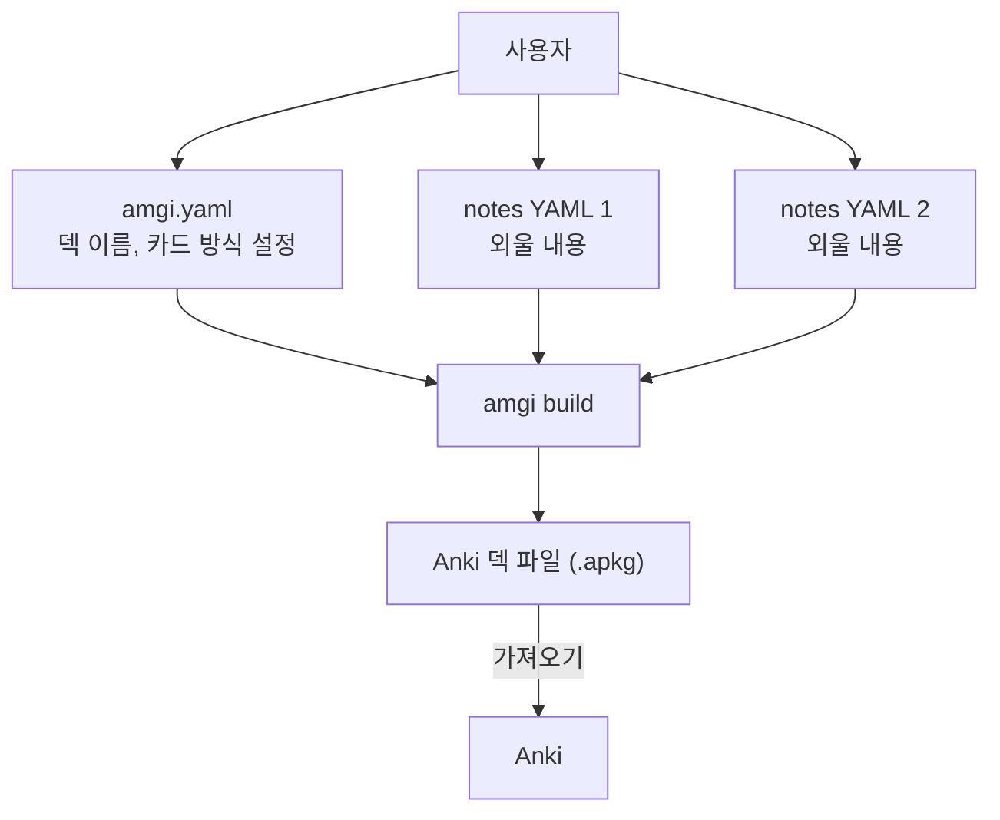

# Amgi

Amgi는 정형화된 YAML 데이터셋을 입력으로 받아 Anki용 `.apkg` 파일을 생성하는 도구입니다.
입력이 텍스트 기반이어서 LLM과 함께 데이터셋을 만들고 다듬기 쉽습니다.

## 개요

각 덱 디렉토리에는 최소한 다음 두 종류의 파일이 필요합니다.

- 설정 파일: `amgi.yaml`
- 데이터 파일: `notes:`가 들어 있는 하나 이상의 YAML 파일

Amgi는 이 파일들을 읽어 `.apkg`를 생성합니다.




하나의 학습 항목에서 여러 카드를 만들 수도 있습니다. 예를 들어 외국어 학습에서는 출발어를 보고 도착어를 맞히는 카드와, 도착어를 보고 출발어를 떠올리는 카드를 함께 생성할 수 있습니다.

특정 데이터 파일에서만 추가 카드를 만들고 싶다면 그 파일에 `_cards:`를 적으면 됩니다. 실제 예시는 [part5.yaml](examples/toeic/part5.yaml)을 참고하세요.
이 YAML 파일 자체에 대한 설명이나 출처 메모를 남기고 싶다면 루트에 `_meta:`를 둘 수 있습니다. Amgi는 `_meta`를 읽지 않습니다.

## 사용

현재는 Nix를 통해서만 패키징되어 있습니다.

```bash
nix run github:nyeong/amgi -- help

# build
nix run github:nyeong/amgi -- build <덱_디렉토리>
nix run github:nyeong/amgi -- build examples/toeic
nix run github:nyeong/amgi -- build examples/toeic -o /tmp/toeic.apkg

# lint
nix run github:nyeong/amgi -- lint <덱_디렉토리>
nix run github:nyeong/amgi -- lint examples/toeic
```

빌드 결과 파일의 경로 우선순위는 다음과 같습니다.

1. `-o <output_path>` 또는 `--out <output_path>`
2. `amgi.yaml`의 `output` 필드. 상대 경로는 덱 디렉토리 기준
3. `<현재 작업 디렉토리>/<name>.apkg`

## 권장 워크플로

1. 계획: 외울 내용을 정리하고 `amgi.yaml`에 덱 스키마를 정의합니다.
   - 필드 정의는 [Amgi v1 Schema](docs/amgi-v1-schema.md)를 참고하세요.
   - 예시는 [공개 예시 덱](examples/toeic/amgi.yaml)을 참고하세요.
2. 수집: 스키마에 맞춰 정형화된 YAML 데이터셋을 작성합니다.
   - 필드 정의는 [Amgi v1 Schema](docs/amgi-v1-schema.md)를 참고하세요.
   - 예시는 [공개 예시 데이터셋](examples/toeic)을 참고하세요.
   - 특정 파일에서만 추가 카드를 만들고 싶다면 `_cards:`를 함께 적습니다.
   - 파일 설명, 출처, 작업 메모처럼 Amgi가 무시해야 하는 정보는 `_meta:`에 넣습니다.
3. 생성: 정의된 카드 규칙에 따라 `.apkg`를 만들고 Anki로 가져옵니다.

## 활용 예시

JLPT 시험을 위해 단어를 암기해야한다고 합시다:

1. 무엇을 어떤 정보와 함께 외울지 정합니다. 한자 단어를 뜻, 후리가나, 예문, 부수 정보와 함께 외운다고 합시다.
2. 그 구조를 `amgi.yaml`의 `note_schema.id`, `note_schema.required_fields`, `note_schema.optional_fields`에 정의합니다.
   - 자세한 규칙은 [Amgi v1 Schema](docs/amgi-v1-schema.md)를 참고하세요.
3. 스키마에 맞는 데이터셋을 YAML로 수집합니다.
   - 대충 단어장 사진으로 찍은 후에 Codex에게 읽도록 시키고 `amgi.yaml` 구조에 맞게 yaml로 뽑아달라고 해도 잘 됩니다.
   - 예를 들면 아래처럼 `notes:` 아래에 `- target: "痛み"` 같은 항목들을 두는 형태입니다.

```yaml
_meta:
  description: "12과 단어들"

notes:
  - target: "痛み"
    meaning: "pain"
```
4. 같은 스키마를 바탕으로 Anki에서 어떤 카드가 생성될지 정의합니다.
   - 자세한 카드 생성 규칙은 [Amgi v1 Schema](docs/amgi-v1-schema.md)를 참고하세요.
   - 대충 Codex한테 까리하게 만들어달라고 하면 잘 해줍니다.
5. Amgi로 `.apkg`를 생성해 Anki에 가져오고 학습합니다.

## 문서

- [Amgi v1 Schema](docs/amgi-v1-schema.md)
- [CLI 명령어](docs/cli-commands.md)
- [의존성과 설치](docs/dependencies.md)
- [개발 워크플로](docs/development.md)
- [프로젝트 상태](TODO.md)
