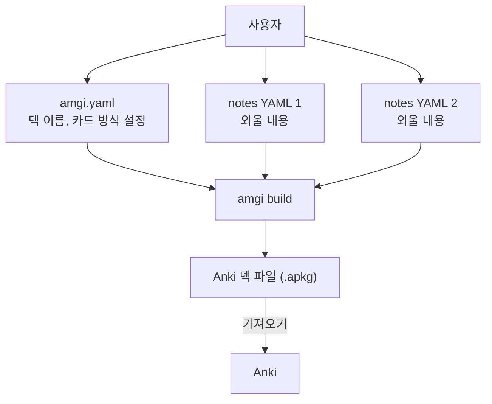

# Amgi

Amgi는 정형화된 YAML 데이터셋을 입력으로 받아 Anki용 `.apkg` 파일을 생성하는 도구입니다.
입력이 텍스트 기반이어서 LLM과 함께 데이터셋을 만들고 다듬기 쉽습니다.

## 개요

각 덱 디렉토리에는 최소한 다음 두 종류의 파일이 필요합니다.

- 설정 파일: `amgi.yaml`
- 데이터셋: `target`을 key로 갖는 `notes:`가 들어 있는 하나 이상의 YAML 파일

Amgi는 이 파일들을 읽어 `.apkg`를 생성합니다.




하나의 학습 항목에서 여러 카드를 만들 수도 있습니다. 예를 들어 외국어 학습에서는 출발어를 보고 도착어를 맞히는 카드와, 도착어를 보고 출발어를 떠올리는 카드를 함께 생성할 수 있습니다.

각 note는 `target`을 key로 삼기 때문에 데이터셋 자체가 note identity의 SSoT가 됩니다. `meaning`, `memo`, 예문을 수정해도 같은 note로 유지되고, `target`을 바꾸면 새 note가 됩니다.

또한 각 dataset 파일은 루트의 `_cards` 배열로 non-default 카드를 opt-in할 수 있습니다. `_cards`가 없으면 그 파일의 note들은 default 카드만 생성되고, `_cards`에 포함된 카드는 해당 note의 front 필드가 모두 있을 때만 추가 생성됩니다.

이 규칙은 파일 단위로 적용됩니다. 예를 들어 `a.yaml`은 `_cards` 없이 default 카드만 만들고, `b.yaml`은 `_cards: ["Recall Target"]`를 두어 default 카드와 `Recall Target`을 함께 만들 수 있습니다. 실제 JLPT 예시에서도 [verbs.yaml](JLPT/n2_frequent_vocabulary_001/verbs.yaml)은 `Recall Target`을 opt-in하고, `_cards`가 없는 파일들은 default 카드만 생성합니다.

## 사용

현재는 Nix를 통해서만 패키징되어 있습니다.

```bash
nix run github:nyeong/amgi -- help

# build
nix run github:nyeong/amgi -- build <덱_디렉토리>
nix run github:nyeong/amgi -- build JLPT/n2_frequent_vocabulary_001
nix run github:nyeong/amgi -- build JLPT/n2_frequent_vocabulary_001 -o /tmp/jlpt.apkg

# lint
nix run github:nyeong/amgi -- lint <덱_디렉토리>
nix run github:nyeong/amgi -- lint JLPT/n2_frequent_vocabulary_001
```

빌드 결과 파일의 경로 우선순위는 다음과 같습니다.

1. `-o <output_path>` 또는 `--out <output_path>`
2. `amgi.yaml`의 `output` 필드. 상대 경로는 덱 디렉토리 기준
3. `<현재 작업 디렉토리>/<name>.apkg`

## 권장 워크플로

1. 계획: 외울 내용을 정리하고 `amgi.yaml`에 덱 스키마를 정의합니다.
   - 필드 정의는 [Amgi v1 Schema](docs/amgi-v1-schema.md)를 참고하세요.
   - 예시는 [JLPT 예시 덱](JLPT/n2_frequent_vocabulary_001/amgi.yaml)을 참고하세요.
2. 수집: 스키마에 맞춰 정형화된 YAML 데이터셋을 작성합니다.
   - 필드 정의는 [Amgi v1 Schema](docs/amgi-v1-schema.md)를 참고하세요.
   - 예시는 [JLPT 예시 데이터셋](JLPT/n2_frequent_vocabulary_001)을 참고하세요.
   - note는 `notes:` 아래에서 `target`을 key로 두고 작성합니다.
   - 특정 파일에서만 추가 카드를 만들고 싶다면 루트에 `_cards:` 배열을 둡니다.
3. 생성: 정의된 카드 규칙에 따라 `.apkg`를 만들고 Anki로 가져옵니다.

## 활용 예시

JLPT 시험을 준비하며 일본어 단어를 암기한다고 가정해 보겠습니다.

1. 어떤 정보를 함께 외울지 정합니다. 예를 들어 단어, 뜻, 후리가나, 예문, 보충 설명이 필요할 수 있습니다.
2. 그 구조를 `amgi.yaml`의 `note_schema.required_fields`, `note_schema.optional_fields`에 정의합니다.
3. 스키마에 맞는 데이터셋을 YAML로 수집합니다.
   - 텍스트 기반 형식이므로, 사진에서 텍스트를 추출한 뒤 LLM으로 구조화하는 식의 작업에도 잘 맞습니다.
   - 예: `notes: { "痛み": { meaning: "통증, 아픔" } }`
   - 추가 카드는 필요한 파일에만 `_cards`를 넣어 켭니다.
4. 같은 스키마를 바탕으로 Anki에서 어떤 카드가 생성될지 정의합니다.
   - default 카드는 항상 생성됩니다.
   - non-default 카드는 dataset 파일의 `_cards`에 이름이 있어야 하고, front에 참조된 필드가 모두 있을 때만 생성됩니다.
5. Amgi로 `.apkg`를 생성해 Anki에 가져오고 학습합니다.

## 문서

- [Amgi v1 Schema](docs/amgi-v1-schema.md)
- [CLI 명령어](docs/cli-commands.md)
- [의존성과 설치](docs/dependencies.md)
- [개발 워크플로](docs/development.md)
- [프로젝트 상태](TODO.md)
