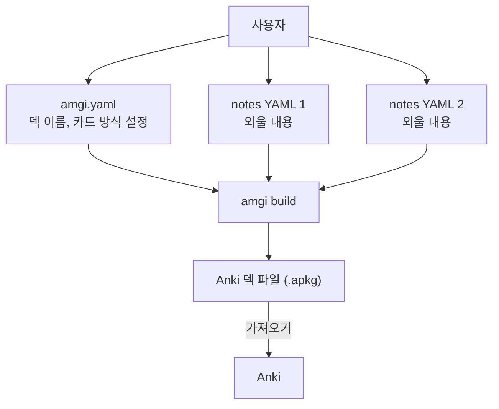

# Amgi

Anki 덱 생성 프로그램. 정형화된 데이터셋을 입력으로 삼아 apkg 파일을 만들어냅니다.
입력이 텍스트 파일이기 때문에 LLM을 활용하기 쉽습니다.

## 동작

디렉토리에 적어도 두 가지 파일이 필요합니다.

- 설정파일 : `amgi.yaml`
- 데이터셋 : `notes:`가 포함된 하나 이상의 YAML 파일

Amgi는 이들을 읽고 `.apkg`를 생성합니다.




이때 하나의 외울 내용으로부터 여러 카드를 만들 수 있습니다. 예를 들어 외국어를 익힐 때, 출발어를 보고 도착어를 맞출 수도 있고, 도착어를 보고 출발어를 맞출 수도 있습니다.

## 사용

현재 Nix로만 패키징되어있습니다.

```
nix run github:nyeong/amgi -- <subcommands>

# build
nix run github:nyeong/amgi -- build <amgi.yaml이 있는 디렉토리>
nix run github:nyeong/amgi -- build JLPT/n2_frequent_vocabulary_001
nix run github:nyeong/amgi -- build JLPT/n2_frequent_vocabulary_001 -o /tmp/jlpt.apkg

# check
nix run github:nyeong/amgi -- lint <amgi.yaml이 있는 디렉토리>
nix run github:nyeong/amgi -- lint JLPT/n2_frequent_vocabulary_001
```

빌드 결과 경로 우선순위는 다음과 같습니다.

1. `-o <output_path>` 또는 `--out <output_path>`
2. `amgi.yaml`의 `output` 필드. 상대경로는 덱 디렉토리 기준
3. `<현재 작업 디렉토리>/<name>.apkg`

아래의 세 가지 단계로 활용하도록 설계하였습니다:

1. 계획 : 외울 내용을 정하고 `amgi.yaml`에 스키마를 작성합니다.
   - 각 필드는 [문서](docs/amgi-v1-schema.md)를 확인해주세요
   - 예시는 [JLPT](JLPT/n2_frequent_vocabulary_001/amgi.yaml)를 확인해주세요
2. 수집 : 스키마에 맞추어 정형화된 `yaml` 파일을 작성합니다.
   - 각 필드는 [문서](docs/amgi-v1-schema.md)를 확인해주세요
   - 예시는 [JLPT](JLPT/n2_frequent_vocabulary_001/)를 확인해주세요
3. 생성 : `amgi.yaml`에 정의된 카드 정의에 따라 `apkg`를 생성하여 활용합니다.

## 활용 시나리오 예시

JLTP 시험을 위해 일본어 단어를 암기하고자 합니다.

1. 어떻게 외워야 잘 외울지 고민합니다. 외울 단어, 뜻, 후리가나, 예문, 부수설명이 있으면 좋겠습니다.
2. 고민을 바탕으로 `amgi.yaml`에 스키마를 작성합니다. `note_schema.required_fields`, `note_schema.optional_fields`를 작성하면 됩니다.
3. 스키마를 바탕으로 외울 데이터셋을 생성합니다.
   - 저는 대충 단어장을 휴대폰으로 찍어서
   - Codex한테 스키마 던져주고 만들어달라고 했습니다.
4. 스키마를 바탕으로 카드, 즉 Anki에서 어떻게 보여질지를 작성합니다.
   - 이것도 Codex한테 해달라했더니 잘 해줬습니다.
4. amgi를 이용해서 `.apkg`를 생성하고 Anki에 올려서 암기합니다.
5. 외우면 됩니다.

## 개발 관련

- 마일스톤 등은 [TODO.md](TODO.md)를 참조하세요.
- 개발환경은 Nix를 쓰고 있습니다. [flake.nix](flake.nix)를 참조하세요.
