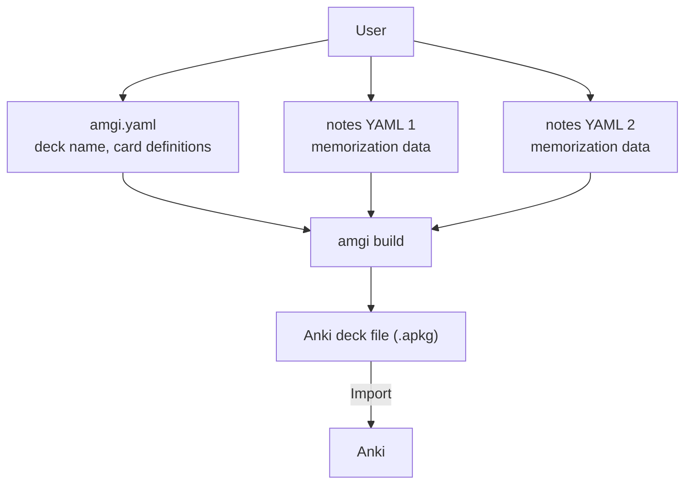

# Amgi

Amgi is an Anki deck builder that reads structured YAML data and generates an
`.apkg` file. Because the input is plain text, it also works well with
LLM-assisted dataset creation and cleanup.

- [한국어 설명](README.ko.md)

## What You Need

Each deck directory needs at least two kinds of files:

- `amgi.yaml` for deck configuration
- one or more YAML dataset files that contain `notes:`

Amgi reads them and builds an `.apkg`.



One learning note can produce multiple cards. For example, a language deck can
generate both source-to-target cards and target-to-source cards from the same
underlying note.

If a specific dataset file should produce extra cards, add `_cards:` to that
file. See the real example in [part5.yaml](examples/toeic/part5.yaml).
If you want human-only notes about that dataset file, add `_meta:` at the
root. Amgi ignores `_meta`.

## Usage

Amgi is currently packaged through Nix.

```bash
nix run github:nyeong/amgi -- help

# Build a deck
nix run github:nyeong/amgi -- build <deck_dir>
nix run github:nyeong/amgi -- build examples/toeic
nix run github:nyeong/amgi -- build examples/toeic -o /tmp/toeic.apkg

# Lint a deck
nix run github:nyeong/amgi -- lint <deck_dir>
nix run github:nyeong/amgi -- lint examples/toeic
```

Build output precedence:

1. `-o <output_path>` (or `--out`)
2. `output` in `amgi.yaml` relative to the deck directory
3. `<current working directory>/<name>.apkg`

## Recommended Workflow

1. Plan the deck in `amgi.yaml`.
   - See [Amgi v1 Schema](docs/amgi-v1-schema.md).
   - See the [example deck](examples/toeic/amgi.yaml).
2. Collect the dataset as structured YAML files.
   - See [Amgi v1 Schema](docs/amgi-v1-schema.md).
   - See the [example dataset](examples/toeic).
   - Add `_cards:` when that file should emit extra card templates.
   - Add `_meta:` for a description, source notes, or other file-level metadata that Amgi should ignore.
3. Build the `.apkg` and import it into Anki.

## Example Use Case

Suppose you are preparing for the JLPT and want to memorize Japanese
vocabulary.

1. Decide what each note should contain, such as the word, meaning, furigana,
   example sentences, and extra explanation.
2. Define that structure in `amgi.yaml` using
   `note_schema.id`, `note_schema.required_fields`, and
   `note_schema.optional_fields`.
3. Collect the dataset as YAML.
   - Since the source format is text-based, it fits well with workflows such as
     extracting text from photos and asking an LLM to structure it.
   - Example:

```yaml
_meta:
  description: "Words from lesson 12"

notes:
  - target: "痛み"
    meaning: "pain"
```

   - Add `_cards:` only to the files that should emit extra templates.
4. Define how cards should be rendered in Anki from the same schema.
   - See [Amgi v1 Schema](docs/amgi-v1-schema.md) for the exact card-generation rules.
5. Build the `.apkg`, import it into Anki, and study.

## Documentation

- [Amgi v1 Schema](docs/amgi-v1-schema.md)
- [CI Usage](docs/ci-usage.md)
- [CLI Commands](docs/cli-commands.md)
- [Dependencies and Installation](docs/dependencies.md)
- [Development Workflow](docs/development.md)
- [Project Status](TODO.md)
