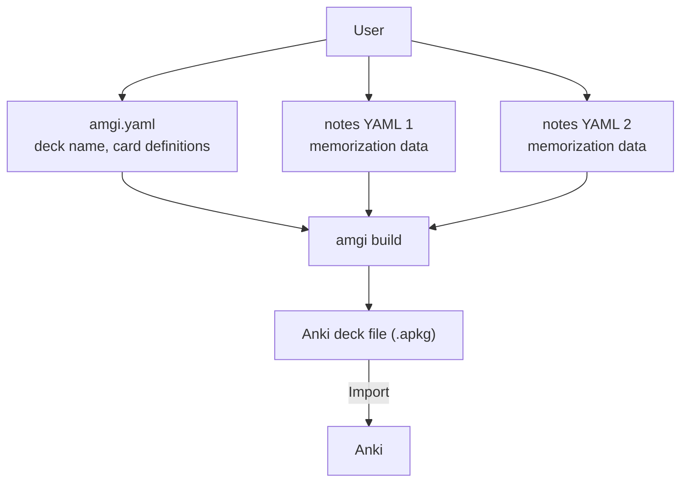

# Amgi

Amgi is an Anki deck builder that reads structured YAML data and generates an
`.apkg` file. Because the input is plain text, it also works well with
LLM-assisted dataset creation and cleanup.

- [한국어 설명](README.ko.md)

## What You Need

Each deck directory needs at least two kinds of files:

- `amgi.yaml` for deck configuration
- one or more YAML dataset files that contain `notes:` keyed by `target`

Amgi reads them and builds an `.apkg`.



One learning note can produce multiple cards. For example, a language deck can
generate both source-to-target cards and target-to-source cards from the same
underlying note.

Each note is keyed by its `target`, so the dataset itself stays the single
source of truth for note identity. Updating `meaning`, `memo`, or example
fields keeps the same note; renaming the `target` creates a new one.

Each dataset file can also opt into extra non-default cards with a root-level
`_cards` list. Without `_cards`, notes in that file generate only the default
card. Enabled non-default cards are still created only when their front-side
fields are present on the note.

That rule is file-scoped. For example, `a.yaml` can omit `_cards` and produce
only the default card, while `b.yaml` can set `_cards: ["Recall Target"]` and
produce the default card plus `Recall Target`. The JLPT example deck follows
that pattern: [verbs.yaml](JLPT/n2_frequent_vocabulary_001/verbs.yaml) opts into
`Recall Target`, while files without `_cards` stay default-only.

## Usage

Amgi is currently packaged through Nix.

```bash
nix run github:nyeong/amgi -- help

# Build a deck
nix run github:nyeong/amgi -- build <deck_dir>
nix run github:nyeong/amgi -- build JLPT/n2_frequent_vocabulary_001
nix run github:nyeong/amgi -- build JLPT/n2_frequent_vocabulary_001 -o /tmp/jlpt.apkg

# Lint a deck
nix run github:nyeong/amgi -- lint <deck_dir>
nix run github:nyeong/amgi -- lint JLPT/n2_frequent_vocabulary_001
```

Build output precedence:

1. `-o <output_path>` (or `--out`)
2. `output` in `amgi.yaml` relative to the deck directory
3. `<current working directory>/<name>.apkg`

## Recommended Workflow

1. Plan the deck in `amgi.yaml`.
   - See [Amgi v1 Schema](docs/amgi-v1-schema.md).
   - See the [JLPT example deck](JLPT/n2_frequent_vocabulary_001/amgi.yaml).
2. Collect the dataset as structured YAML files.
   - See [Amgi v1 Schema](docs/amgi-v1-schema.md).
   - See the [JLPT example dataset](JLPT/n2_frequent_vocabulary_001).
   - Write notes as a mapping keyed by `target`.
   - Add `_cards` at the file root when that source file should emit extra card templates.
3. Build the `.apkg` and import it into Anki.

## Example Use Case

Suppose you are preparing for the JLPT and want to memorize Japanese
vocabulary.

1. Decide what each note should contain, such as the word, meaning, furigana,
   example sentences, and extra explanation.
2. Define that structure in `amgi.yaml` using
   `note_schema.required_fields` and `note_schema.optional_fields`.
3. Collect the dataset as YAML.
   - Since the source format is text-based, it fits well with workflows such as
     extracting text from photos and asking an LLM to structure it.
   - Use `target` as the note key, for example `notes: { "痛み": { meaning: ... } }`.
   - Add `_cards` only to the files that should emit extra templates.
4. Define how cards should be rendered in Anki from the same schema.
   - The default card is always generated.
   - Non-default cards must be enabled by the dataset file's `_cards` list and
     still require every front-side field.
5. Build the `.apkg`, import it into Anki, and study.

## Documentation

- [Amgi v1 Schema](docs/amgi-v1-schema.md)
- [CLI Commands](docs/cli-commands.md)
- [Dependencies and Installation](docs/dependencies.md)
- [Development Workflow](docs/development.md)
- [Project Status](TODO.md)
