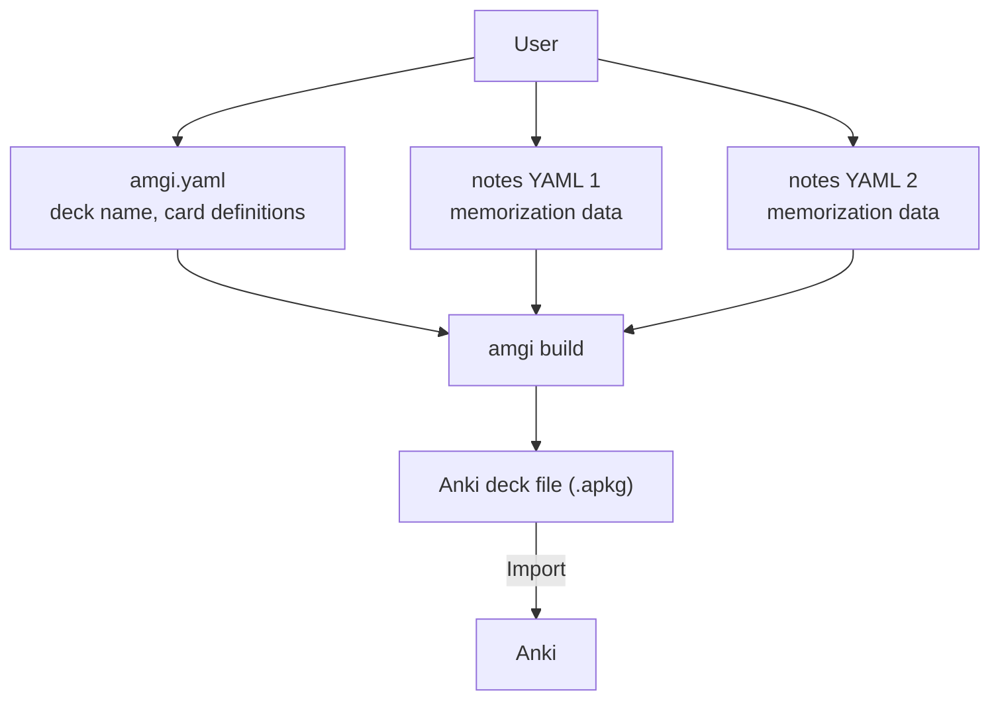

# Amgi

Amgi is an Anki deck builder that reads structured YAML data and generates an
`.apkg` file.

## What You Need

Each deck directory needs at least two kinds of files:

- `amgi.yaml` for deck configuration
- one or more YAML dataset files that contain `notes:`

Amgi reads them and builds an `.apkg`.



## Usage

Amgi is currently packaged through Nix.

```bash
nix run github:nyeong/amgi -- help

# Build a deck
nix run github:nyeong/amgi -- build <deck_dir>
nix run github:nyeong/amgi -- build JLPT/n2_frequent_vocabulary_001
nix run github:nyeong/amgi -- build JLPT/n2_frequent_vocabulary_001 -o /tmp/jlpt.apkg

# Lint a deck
nix run github:nyeong/amgi -- lint <deck_dir>
nix run github:nyeong/amgi -- lint JLPT/n2_frequent_vocabulary_001
```

Build output precedence:

1. `-o <output_path>` (or `--out`)
2. `output` in `amgi.yaml` relative to the deck directory
3. `<current working directory>/<name>.apkg`

## Recommended Workflow

1. Plan the deck in `amgi.yaml`.
   - See [Amgi v1 Schema](docs/amgi-v1-schema.md).
   - See the [JLPT example deck](JLPT/n2_frequent_vocabulary_001/amgi.yaml).
2. Collect the dataset as structured YAML files.
   - See [Amgi v1 Schema](docs/amgi-v1-schema.md).
   - See the [JLPT example dataset](JLPT/n2_frequent_vocabulary_001).
3. Build the `.apkg` and import it into Anki.

## Documentation

- [Amgi v1 Schema](docs/amgi-v1-schema.md)
- [CLI Commands](docs/cli-commands.md)
- [Dependencies and Installation](docs/dependencies.md)
- [Development Workflow](docs/development.md)
- [Project Status](TODO.md)
